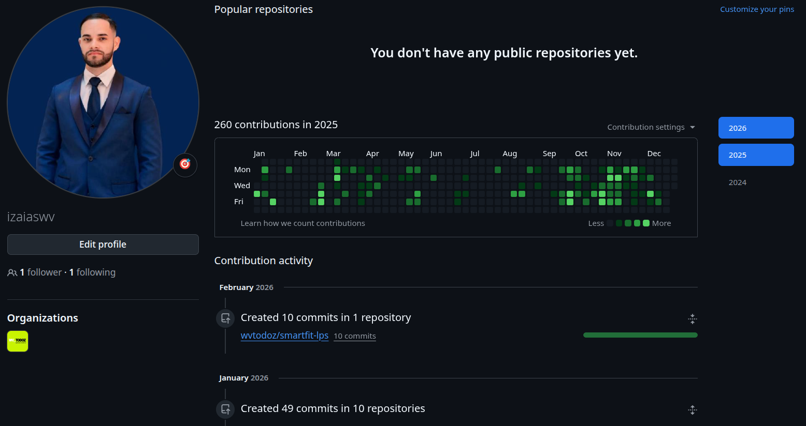

# Olá, eu sou o Izaias Ramos! 👋
## 🚀 Desenvolvedor Fullstack | JavaScript & PHP

Sou um desenvolvedor apaixonado por criar soluções web completas e performáticas. Atualmente, atuo como **Programador Fullstack na Wv_todoz**, onde sou responsável por projetos de alto impacto para clientes como a **Smart Fit** integrando o Front com APIs robustas, manipulando dados e fazendo validações seguras.

Estou cursando **Engenharia de Software** (8º semestre).

---

### 🛠️ Tech Stack & Ferramentas

Organizo meu conhecimento nas seguintes áreas, com base na minha experiência prática:

**Frontend**

  
  
  
  
  

**Backend**

  
  
  
  
  

**DevOps & Tools**

  
  
  
  

---

### 💼 Experiência Profissional em Destaque

* **Wv_todoz (Atual):** Desenvolvimento e manutenção de Landing Pages responsivas para a **Smart Fit**, integrando APIs, validações complexas e realizando deploy em **AWS S3**.
* **Wv_todoz (Migração):** Participei da migração de um sistema legado (Codeigniter) para um stack moderno com **Laravel e Nuxt.js**, melhorando a performance e manutenção.
* **Amazul (Tecnologias de Defesa):** Desenvolvimento de sistema de votação para funcionários em nível nacional.

### 📊 Estatísticas do GitHub

    
    
  

### 📫 Vamos nos conectar?

* **LinkedIn:** [linkedin.com/in/izaias-ramosdesenvolvedor](https://www.linkedin.com/in/izaias-ramosdesenvolvedor)
* **Email:** izaiasr232@gmail.com
* **WhatsApp:** (11) 99811-0569

### 🧑‍💻 Atuação Profissional em Repositórios Privados

Grande parte do meu trabalho diário ocorre em repositórios corporativos privados, vinculados ao GitHub profissional utilizado no ambiente de trabalho.

A imagem abaixo demonstra minha frequência de commits, contribuições contínuas e atuação ativa em projetos reais em produção:

  

  

> Por questões de confidencialidade, os repositórios exibidos são privados.  
> Este perfil concentra projetos pessoais, estudos e demonstrações técnicas.

